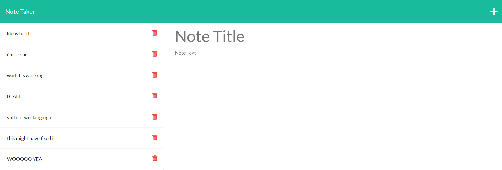

  # Notepad
  

  ## Table of Contents:
  * [Description](#description)
  * [Installation](#installation)
  * [Usage](#usage)
  
 * [License](#license)
  * [Contributors](#contributors)
  * [Questions](#questions)
  
  ## Description:
  Notepad was created from a provided front-end template. The back-end functionality allows users to input and save notes using API endpoints via express.js.
  
 https://jb-note-taker-123.herokuapp.com/

  ## Installation:
  The app is hosted on heroku; please visit the provided link to utilize the app.

  ## Usage:
  Simply type the desired title and note content into the provided spaces. When the note is complete, press the save button to save it to the left side of the screen. To view previous notes, click on the note as it appears on the left side of the screen. 
    
  
 ## License:
  Licensed under the MIT license.

  ## Contributors
  Please feel free to contribute by opening issues on GitHub.

  ## Questions
  You can reach me for additional questions at:
  * GitHub: [jtboyman](https://github.com/jtboyman)
  * Email: jtboyman@gmail.com
